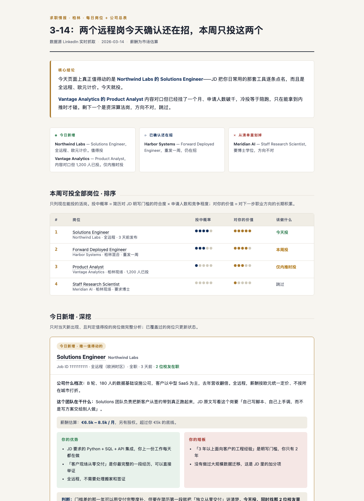

# job-match-board

给 [Claude Code](https://claude.com/claude-code) 用的一个 skill：把一页 LinkedIn 岗位列表，变成一张对着**你的简历**算出来的求职看板。

不是泛泛的求职建议。你给简历和一个 LinkedIn 岗位页链接，它会去把每个岗位的 JD 和公司资料真的抓下来，逐条对照你的经历，判出每个岗位的匹配度、投中概率、你的优势、你的短板，以及现在该做什么——最后生成一个可以每天看的 HTML 页面。



## 它解决什么

投简历最费时间的不是写简历，是**判断该投哪个**。LinkedIn 的推荐排序按竞价走，排第一的常常是猎头发的外包合同岗。人工一个个开 JD 读、查公司、对自己的简历，一页十几个岗位要花两小时，而且第二天就忘了昨天判过什么。

这个 skill 把这件事变成每天十分钟：固定链接、固定结构、跨天记得上次的结论。

## 页面里有什么

- **核心结论** —— 今天投什么、按什么顺序，理由放后面
- **今日变化三栏** —— 新增了什么 / 哪些确认还在招 / 哪些从清单里划掉
- **排序表** —— 所有能投的岗位，带投中概率和价值两个维度的评分
- **重点岗位深挖** —— 优势 / 短板双栏对照 + 一句话判断
- **全部岗位总表** —— 可按分档筛选，每个岗位带匹配度分数、公司质量色灯（🟢🟡🔴）、是否还在招
- **薪酬估算** —— 对照你的底线，标出超过 / 擦线 / 低于
- **不投清单** —— 每条写明为什么不投，避免过几天又捡起来
- **执行计划** —— 按天排的具体动作

页面自适应深色/浅色主题，手机上也能看。

## 安装

需要 Python 3.9+，不需要装任何依赖。

```bash
git clone https://github.com/<your-account>/job-match-board.git ~/.claude/skills/job-match-board
```

装好后在 Claude Code 里说「帮我分析这页岗位」并附上简历和链接就会触发，也可以直接 `/job-match-board`。

### 抓 LinkedIn 数据

这个 skill 通过 [LinkedIn MCP server](https://github.com/stickerdaniel/linkedin-mcp-server) 抓数据，用你自己已登录的会话。如果你的环境里已经挂了这个 MCP，skill 会直接用；没挂的话，`scripts/li_mcp.py` 会按 `~/.claude.json` 里的配置起一个 stdio 客户端。

抓不到数据时会退回公开的 `linkedin.com/jobs/view/<id>` 页面——未登录也能看到 JD 正文，只是拿不到申请人数和校友信息。

## 自己跑构建脚本

页面生成和分析是分开的：分析产出一个 `board.json`，构建脚本把它变成 HTML。所以你也可以不通过 Claude、手写 JSON 来用它。

```bash
# 看示例长什么样
python3 scripts/build_board.py examples/board.example.json /tmp/demo.html
open /tmp/demo.html

# 改完确认没弄坏
python3 scripts/test_build.py
```

构建脚本会先校验再渲染。字段缺失、枚举写错、总表里公司重名、模板占位符没填满，都会带着出错位置报错停下：

```
构建失败：$.board[2].light = 'blue'，只能是 ['green', 'red', 'yellow'] 之一
```

## 目录

```
SKILL.md                     skill 本体：怎么读简历、怎么抓数据、怎么判读、怎么写字
assets/template.html         页面模板（CSS + 前端筛选逻辑）
scripts/build_board.py       board.json → HTML，带校验
scripts/test_build.py        16 条回归用例
scripts/li_mcp.py            LinkedIn MCP stdio 客户端
scripts/batch.py             一个浏览器会话里批量跑多个调用
examples/board.example.json  完整可跑的示例数据（人物公司均虚构）
examples/profile.example.json 你的求职偏好，第一次问出来存下复用
```

## 几条设计上的固执

- **匹配度和公司质量分开算。** 混在一起，猎头发的完美 JD 会被顶到第一名——那是竞价买来的排序，不是好机会。
- **短板必须诚实。** 明写的 required 就说是硬门槛，不安慰。简历里没有的经历不替你吹出来。
- **状态不许装作知道。** 今天真的开过页面确认的才标"在招"，沿用旧数据的标"未再查"。
- **说人话。** 不用军事和游戏比喻，不用行业黑话。
- **每天先复查旧待办，再找新岗。** 一个上周就该投、今天确认还开着的好岗位，比三个新岗更重要。

## License

MIT
