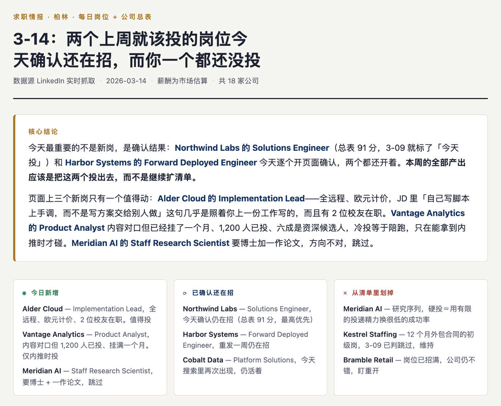
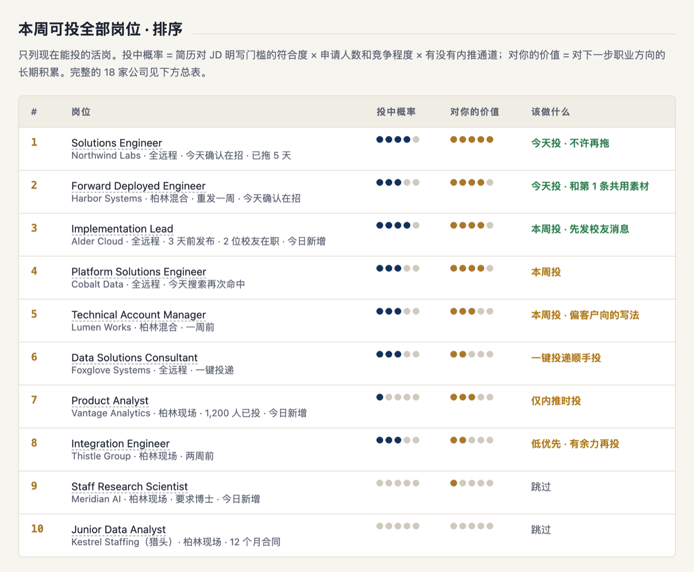
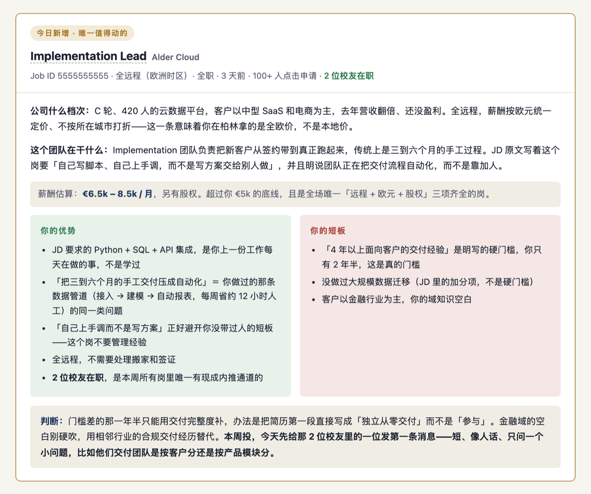
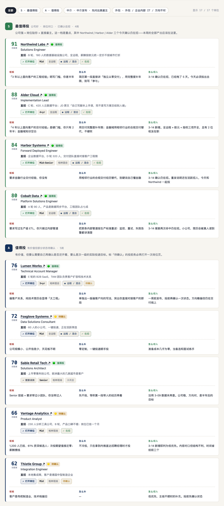
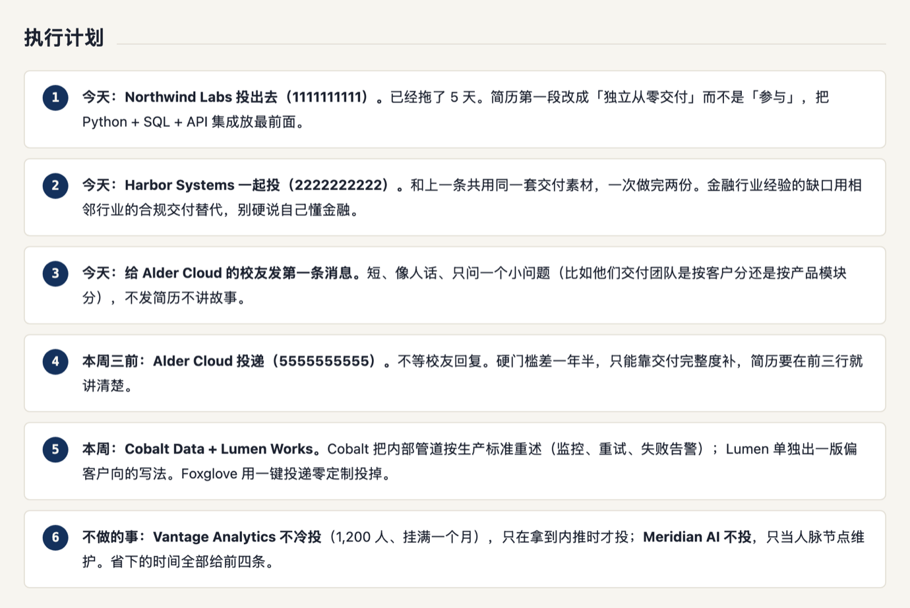

# job-match-board

给 [Claude Code](https://claude.com/claude-code) 用的一个 skill：把一页 LinkedIn 岗位列表，变成一张对着**你的简历**算出来的求职看板。

你给两样东西——简历，和一个 LinkedIn 岗位页链接。它会把每个岗位的 JD 和公司资料真的抓下来，逐条对照你的经历，判出匹配度、投中概率、你的优势、你的短板，最后生成一个可以每天看的 HTML 页面。



## 它解决什么

投简历最费时间的不是写简历，是**判断该投哪个**。

LinkedIn 的推荐排序按竞价走，排第一的常常是猎头发的外包合同岗。人工一个个开 JD 读、查公司、对自己的简历，一页十几个岗位要花两小时，而且第二天就忘了昨天判过什么——于是每天重新读一遍同样的岗位，真正该投的那个一直躺在待办里。

这个 skill 把它变成每天十分钟：固定链接、固定结构、跨天记得上次的结论。上面那张图里最上面那句话就是它每天最先告诉你的东西——**不是"今天有什么新岗"，而是"你上周就该投的那两个今天还开着"**。

## 怎么用

装好之后（见下面「安装」），在 Claude Code 里直接说：

```
帮我分析这页岗位
简历在 ~/Documents/resume.pdf
https://www.linkedin.com/jobs/search-results/?currentJobId=...&originToLandingJobPostings=...
```

或者用 `/job-match-board` 触发。

**第一次跑**它会先问三件事，问完存进 `profile.json`，之后每天复用不再重问：

| 问什么 | 为什么必须问 |
|---|---|
| 薪酬底线（金额 + 币种） | 没有底线就没法判一个岗是"远超"还是"擦线"，薪酬那一栏会变成废话 |
| 地点与远程偏好 | 决定纯现场岗要不要直接降级 |
| 在找什么方向 | 决定哪些岗位直接进不投清单——想做交付的人不该被推荐要博士的研究岗 |

**之后每天**只要丢一个新的 LinkedIn 链接。它会先复查上次的待办还开不开着，再看新岗。

**缺简历会怎样**：它会明说「只能列岗位、判不了匹配」，让你选补简历还是接受降级版本——不会假装分析过。

### 它做了什么

1. 从 URL 里抠出 `currentJobId` 和 `originToLandingJobPostings`——这类个性化推荐页用关键词搜索复现不了，URL 里的 ID 是唯一可靠的锚点
2. 逐个抓 JD 全文、公司规模、员工增速、中位任期、申请人数、申请人资历分布、有没有校友或前同事在职
3. 从简历里提炼四样东西立成标尺：能举证的经历、账面事实（年限/职级/行业）、真实短板、方向
4. 每个岗位过同一套筛子，输出分数和三栏结论
5. 填成 `board.json`，跑构建脚本出 HTML
6. 发布成固定链接，第二天更新同一个链接

## 产出长什么样

下面所有截图来自 `examples/board.example.json`，**人物、公司、数据全是虚构的**。

### 排序表：所有能投的岗位，两个维度分开打分



投中概率和"对你的价值"是两件事，分开评。一个岗位可能很好投但对你没用（第 6 行），也可能极有价值但基本没戏（第 7 行）——合成一个分数就看不见这个区别了。

### 重点岗位：优势 / 短板双栏对照



优势那一栏要求逐条引用简历里**能举证**的经历，对上 JD 的具体某一条；短板那一栏必须区分**硬门槛**（明写的 required）和**加分项**，是硬门槛就说是硬门槛，不安慰。最后一句永远是一个具体动作，不是"优化简历"。

### 全部岗位总表：可筛选，带公司质量色灯



分数只说岗位本身贴不贴你，公司好不好由色灯单独表示——这两件事混在一起，猎头发的完美 JD 会被顶到第一名。状态标记（✓ 在招 / 待确认 / 已招满 / 未再查）逼你诚实：只有当天真的开过页面确认的才能标"在招"。

中介发布的岗位单独归一档，因为对它们该做的动作不是投递，是先问出真实雇主是谁。

### 执行计划：按天排的具体动作



包括**明确不做的事**。最后一条永远是"今天不做什么、省下的时间给谁"——没有这条，清单只会越滚越长。

## 安装

需要 Python 3.9+，不需要装任何依赖。

```bash
git clone https://github.com/<your-account>/job-match-board.git ~/.claude/skills/job-match-board
```

### 抓 LinkedIn 数据

通过 [LinkedIn MCP server](https://github.com/stickerdaniel/linkedin-mcp-server) 抓，用你自己已登录的会话。环境里已经挂了这个 MCP 的话 skill 会直接用；没挂的话 `scripts/li_mcp.py` 会用 `uvx` 起一个 stdio 客户端：

```bash
# uvx 不在 PATH 上时
export LI_MCP_UVX=/path/to/uvx
```

完全抓不到时会退回公开的 `linkedin.com/jobs/view/<id>` 页面——未登录也能看到 JD 正文，只是拿不到申请人数和校友信息。

## 不用 Claude 也能跑

分析和出页面是分开的：分析产出 `board.json`，构建脚本负责变成 HTML。所以你可以手写 JSON 直接用它当静态页生成器。

```bash
python3 scripts/build_board.py examples/board.example.json /tmp/demo.html
open /tmp/demo.html

python3 scripts/test_build.py     # 改完确认没弄坏
```

构建脚本先校验再渲染，出错带位置：

```
构建失败：$.board[2].light = 'blue'，只能是 ['green', 'red', 'yellow'] 之一
构建失败：$.board[5].company = 'Alder Cloud' 重复；同一家公司在总表里只能出现一次
构建失败：$.tiers.broker 缺失，但 $.board 里有属于这一档的岗位
```

16 条回归用例里有 11 条是反例——断言"这种输入必须报错"。每一条都撤掉对应的校验确认过它会变红：只能变绿的测试教人忽略红色。

## 目录

```
SKILL.md                      skill 本体：怎么读简历立标尺、怎么抓数据、怎么判读、怎么写字
assets/template.html          页面模板（CSS + 前端筛选逻辑），深浅色双主题
scripts/build_board.py        board.json → HTML，先校验再渲染
scripts/test_build.py         16 条回归用例
scripts/li_mcp.py             LinkedIn MCP stdio 客户端
scripts/batch.py              一个浏览器会话里批量跑多个调用
examples/board.example.json   完整可跑的示例数据（人物公司均虚构）
examples/profile.example.json 求职偏好，第一次问出来存下复用
```

`profile.json`、`board.json`、`resume.*` 在 `.gitignore` 里——你的真实数据不会被误提交。

## 几条设计上的固执

- **匹配度和公司质量分开算。** 混在一起，竞价买来的排序会伪装成好机会。
- **短板必须诚实。** 明写的 required 就说是硬门槛。简历里没有的经历不替你吹出来。
- **状态不许装作知道。** 当天确认过的才标"在招"，沿用旧数据的标"未再查"。
- **说人话。** 不用军事和游戏比喻（弹药、靶位、赛道、打法），不用行业黑话。
- **每天先复查旧待办，再找新岗。** 一个上周就该投、今天确认还开着的好岗位，比三个新岗更重要。

## License

MIT
